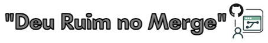

<h1 align=left>
  
</h1>

### Sistema Web [Lembra Compras](https://academy-lembra-compras.herokuapp.com)
### API: [Swagger](https://lista-compras-api.herokuapp.com/api-docs)

Os testes foram realizados no sistema desenvolvido por [Raro Labs](https://rarolabs.com.br/), o sistema ***Lembra Compras***  que tem como propósito auxiliar seus usuários a lembrarem de produtos a serem comprados durante a ida à a comércios do dia à dia, como supermercados, padarias, mercearias, etc.

Os usuários podem se cadastrar para ter acesso a aplicação, o que permite que possam cadastrar suas listas de compras e, posteriormente, consultar as compras que já foram feitas anteriormente, permitindo controle e reutilização destas informaçõs para a elaboração de listas futuras. [Especificações do sistema](Assets/especificacao-lembra-compras.md)

---

### Objetivo do trabalho

O Objetivo do trabalho final foi aplicar os conhecimentos que acumulamos durante todo o curso:

1. Métodos de teste;
2. Documentação viva com BDD e Gherkin;
3. Testes de API;
4. Testes ponto à ponto;
5. Trabalho e interação em equipe

---

#### BDD
Foram consideradas as especificações do sistema Lembra Compras, analisadas as *users storires* e critérios de aceite.
Os cenários foram documentados no formato de Gherkin e foram utilizados para testar os critérios no sistema.

---
### Testes funcionais e exploratórios
Foi considerado o roteiro de testes definido em nosso BDD, realizado testes funcionais e exploratórios no sistema web, no qual foram encontrados bugs e documentados na ferramenta [Trello](https://trello.com/invite/b/K7HZskcV/1e8e747e4462969e2a75ceade98a1933/academy-trabalho-final-grupo-3)

---
### Testes automatizados de API com Karate Framework
Foi criado um projeto de testes de API utilizando o Karate Framework, para validar os critérios de aceite implementados na API do Lembra Compras [Swagger](https://lista-compras-api.herokuapp.com/api-docs)

---
### Testes automatizados de Frontend com Cypress
Foi criado um projeto de testes de Frontend utilizando o framework Cypress e configurado utilizando a ferramenta Cucumber para integrar com os arquivos de Feature.

---
### Autores

-   **[Élida](https://github.com/eligoncalves13)**
-   **[Kamilly](https://github.com/Kamillytiburtino)**
-   **[Lucas Chitolina](https://github.com/Chitolina)**
-   **[Rosicléia](https://github.com/Rosicleia)**
